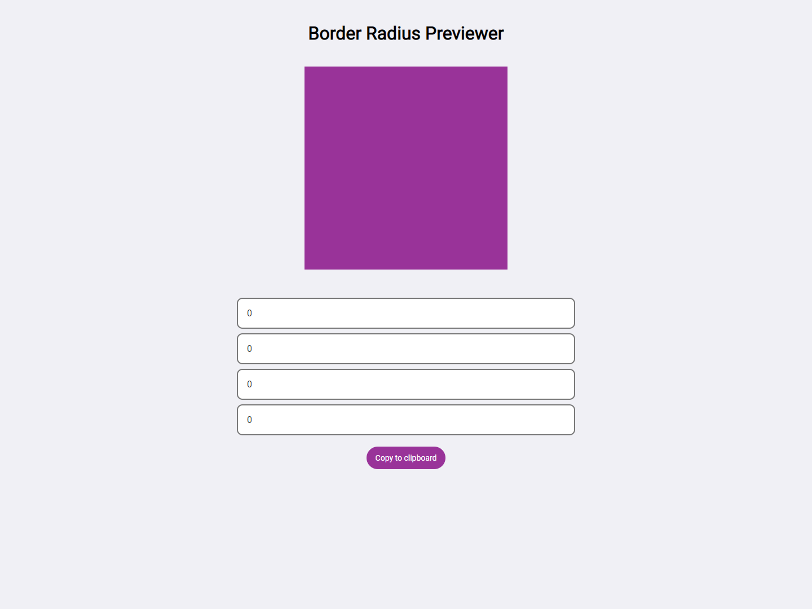
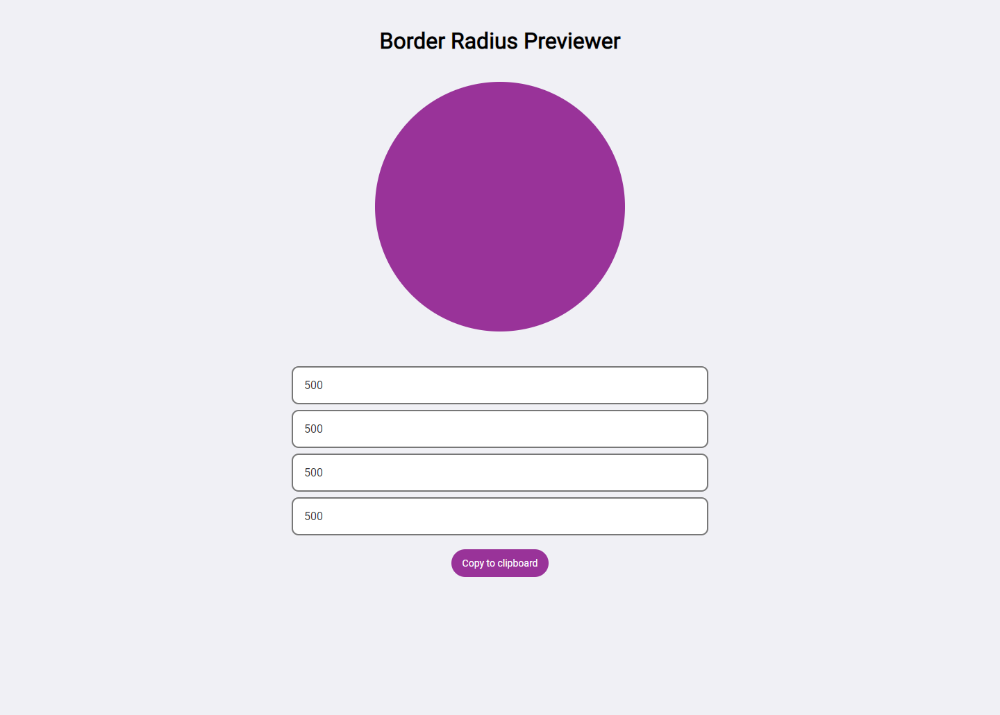

<h1 align="center">
 
Border Radius Previewer
</h1>

This project was created to explore border-radius css.

  

  
  

## Features

- Change 4 border-radius values and see changes.
- Copy to clipboard the resulting css.

- ⚛️ **React Js** — A JavaScript library for building user interfaces

## Getting started

- Clone project > enter the project folder
- run `yarn`
- run `yarn start`

## License

This project is licensed under the MIT License - see the [LICENSE](https://opensource.org/licenses/MIT) page for details.

---

Created with passion by me 👨🏻‍💻
