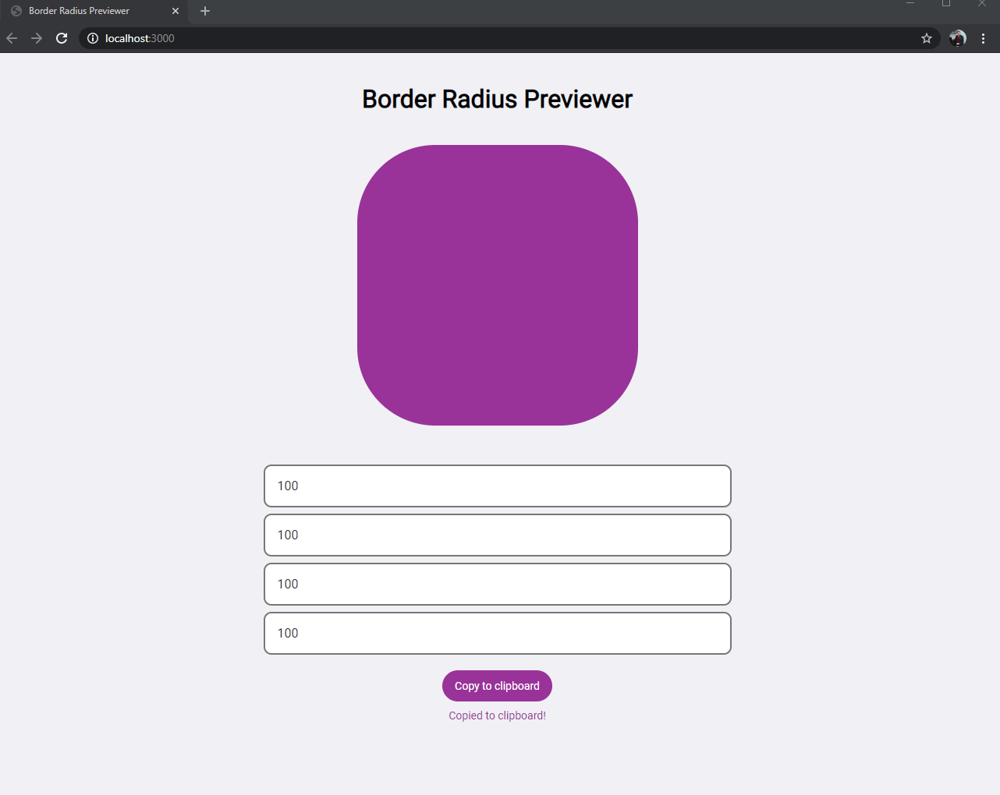

<h3 align="center">
  Challenge: Border Radius Previewer
</h3>

  <a href="#pencil-about-challenge">About Challenge</a>&nbsp;&nbsp;&nbsp;|&nbsp;&nbsp;&nbsp;
  <a href="#memo-licença">License</a>

## :pencil: About Challenge

The border-radius property can have multiple values changed. Preview how the shape looks while changing these values.

## Screens

## User Stories

- [x] User can see a box which has a `border-radius` property applied to it
- [x] User can change the 4 `border-radius` values that are applied to the box (top-left, top-right, bottom-left, bottom-right)
- [x] User can copy the resulting CSS to the clipboard

## :memo: Licença

Esse projeto está sob a licença MIT. Veja o arquivo [LICENSE](LICENSE) para mais detalhes.

---

Made by me 👨🏻‍💻
